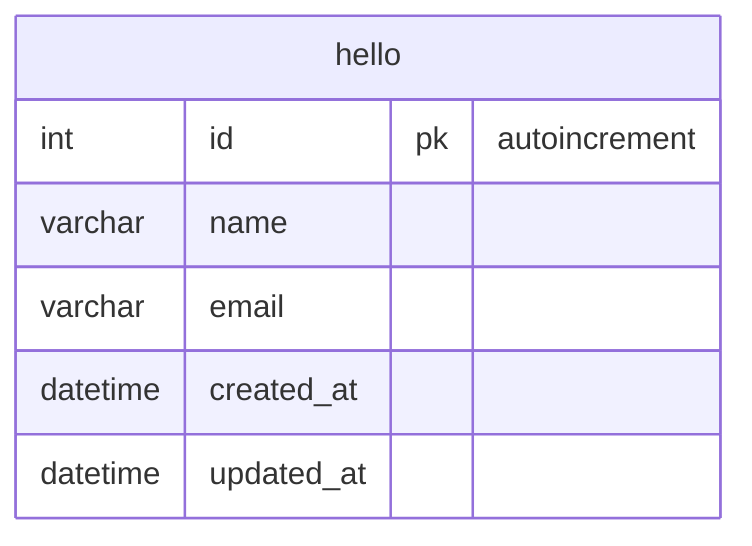

# A command line tool to generate restful api for database

The database schema is defined as mermaid syntax, and the tool will generate the restful api for the database.

```mermaid
erDiagram
hello {
  int id pk "autoincrement"
  varchar name
  varchar email
  datetime created_at
  datetime updated_at
}
```